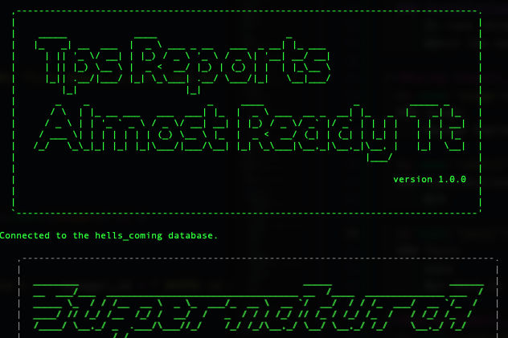

# TPS_Reports_Almost_Ready_TT

  ## Table of Contents
  * [Description](#descrip)
  * [Installation](#install)
  * [Usage](#usage)
  * [Contributions](#contri)
  * [Tests](#tests)
  * [Contact & Questions](#contact) 
  * [License](#license)
  * [Powered By](#powered-by)

  
  ### Description:
      "Human Resources...," the tired hero pondered this phrase.  He thought the only thing worse than calling people resources was to call them captial.  He had heard of a dark place where all the people who belonged to this guild made sacrifices of others to keep themselves in power.  What a wicked place that would be.  He was glad that he did not belong with them, but quests are quests and no cry for help should be ignored.  
      Creating something from nothing was something that many people had asked the lonely traveler to do, and he realized that his journey was requiring more of this from his tested mind.  This request would be no different, so he he reached for his conjuring book and thumbed mindlessly through its pages hoping that inspiration would strike.  The book jumped to life and the pages started turning themselves.  As the wind whirled around him, he could see the path forward.  The spell required a simple command line to run.  Inquirer would have to be cast and a sql would follow.  He laughed to himself.  It was just like people to plan for a sql before even finishing the first thing. As the hours passed, queries were created that would call forth the power of the data and with a simple stroke even those tortured souls in hr could accomplish their endless tasks of moving bits from here to there.  The magic was weak and would only trap representations of the people in this database.  He was sure that the creatures in HR wanted more power than this, and while they had the ability to alter where someone belonged,  he would not participate in giving them any more power.    
      His work was never done, but his book had gone lifeless.  He knew there was no more help it could give.  Reluctantly, he closed it's pages and sighed a tired breath.  Times like these were what tried his soul, but he would finish the work and press on to the adventures that waited...

      

      

  
  ### Installation:
      It runs through the command line
      Watch the excitment on the following video!

  
  ### Usage: 
      Manage Employees

  
  ### Contributions:
      Self referencing table and other SQL queries inspired by
[SQLserver tutorial.net](https://www.sqlservertutorial.net/sql-server-basics/sql-server-self-join/)

  
  ### Tests
      none
      But here is another link to the video!

 

  
  ### Contact & Qustions
  If you have any questions, suggestions or concerns, please contact me at:  
  GitHub  
  https://github.com/DerTodd  
  email  
      todd.taylor@utexas.edu  

  
  ### License:
  [MIT](https://opensource.org/licenses/MIT)

  
  #### Powered By
    
    
   

